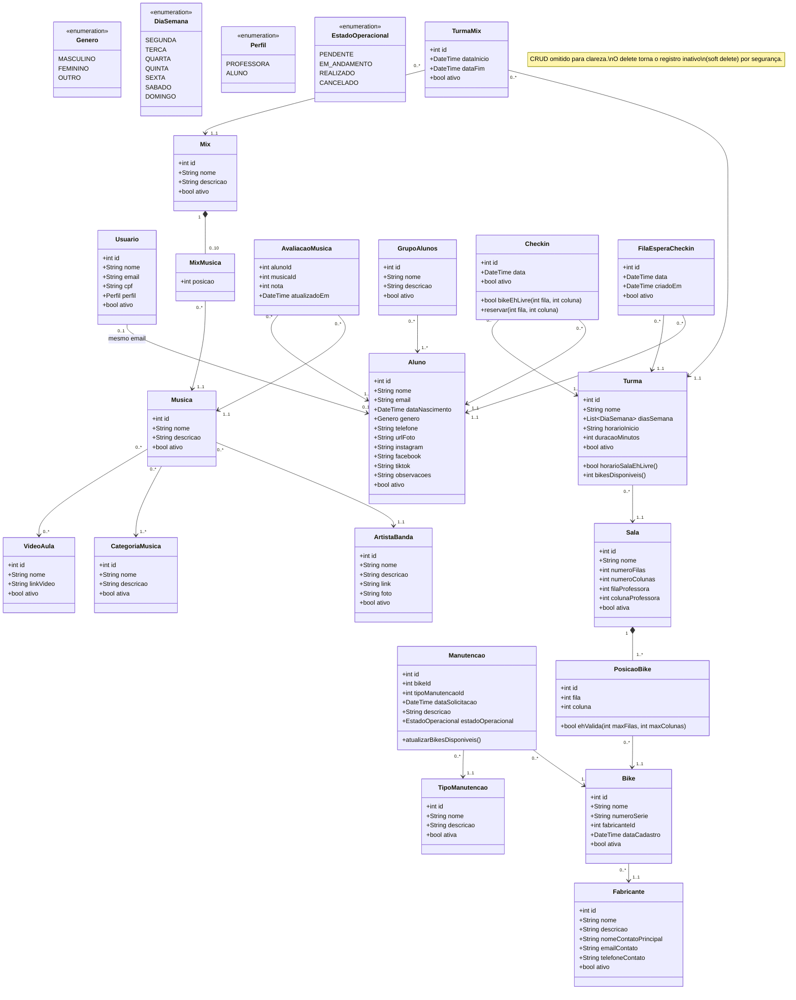

```mermaid
classDiagram
    direction TB

    %% Enumerações
    class Genero {
        <<enumeration>>
        MASCULINO
        FEMININO
        OUTRO
    }

    class DiaSemana {
        <<enumeration>>
        SEGUNDA
        TERCA
        QUARTA
        QUINTA
        SEXTA
        SABADO
        DOMINGO
    }

    class Perfil {
        <<enumeration>>
        PROFESSORA
        ALUNO
    }

    %% Autenticação
    class Usuario {
        +int id
        +String nome
        +String email
        +String cpf
        +Perfil perfil
        +bool ativo
    }

    %% Folhas — Bikes e Manutenção
    class Fabricante {
        +int id
        +String nome
        +String descricao
        +String nomeContatoPrincipal
        +String emailContato
        +String telefoneContato
        +bool ativo
    }

    class TipoManutencao {
        +int id
        +String nome
        +String descricao
        +bool ativa
    }

    class Bike {
        +int id
        +String nome
        +String numeroSerie
        +int fabricanteId
        +DateTime dataCadastro
        +bool ativa
    }

    class EstadoOperacional {
        <<enumeration>>
        PENDENTE
        EM_ANDAMENTO
        REALIZADO
        CANCELADO
    }

    class Manutencao {
        +int id
        +int bikeId
        +int tipoManutencaoId
        +DateTime dataSolicitacao
        +String descricao
        +EstadoOperacional estadoOperacional
        +atualizarBikesDisponiveis()
    }

    %% Folhas — Música
    class ArtistaBanda {
        +int id
        +String nome
        +String descricao
        +String link
        +String foto
        +bool ativo
    }

    class CategoriaMusica {
        +int id
        +String nome
        +String descricao
        +bool ativa
    }

    class VideoAula {
        +int id
        +String nome
        +String linkVideo
        +bool ativo
    }

    class Mix {
        +int id
        +String nome
        +String descricao
        +bool ativo
    }

    class MixMusica {
        +int posicao
    }

    class Musica {
        +int id
        +String nome
        +String descricao
        +bool ativo
    }

    class AvaliacaoMusica {
        +int alunoId
        +int musicaId
        +int nota
        +DateTime atualizadoEm
    }

    %% Salas e Turmas
    class Sala {
        +int id
        +String nome
        +int numeroFilas
        +int numeroColunas
        +int filaProfessora
        +int colunaProfessora
        +bool ativa
    }

    class PosicaoBike {
        +int id
        +int fila
        +int coluna
        +bool ehValida(int maxFilas, int maxColunas)
    }

    class Turma {
        +int id
        +String nome
        +List~DiaSemana~ diasSemana
        +String horarioInicio
        +int duracaoMinutos
        +bool ativo
        +bool horarioSalaEhLivre()
        +int bikesDisponiveis()
    }

    class TurmaMix {
        +int id
        +DateTime dataInicio
        +DateTime dataFim
        +bool ativo
    }

    %% Alunos
    class Aluno {
        +int id
        +String nome
        +String email
        +DateTime dataNascimento
        +Genero genero
        +String telefone
        +String urlFoto
        +String instagram
        +String facebook
        +String tiktok
        +String observacoes
        +bool ativo
    }

    class GrupoAlunos {
        +int id
        +String nome
        +String descricao
        +bool ativo
    }

    class Checkin {
        +int id
        +DateTime data
        +bool ativo
        +bool bikeEhLivre(int fila, int coluna)
        +reservar(int fila, int coluna)
    }

    class FilaEsperaCheckin {
        +int id
        +DateTime data
        +DateTime criadoEm
        +bool ativo
    }

    note "CRUD omitido para clareza.\nO delete torna o registro inativo\n(soft delete) por segurança."

    %% Associações — Autenticação
    Usuario "0..1" --> "0..1" Aluno : mesmo email

    %% Associações — Bikes e Manutenção
    Bike "0..*" --> "1..1" Fabricante
    Manutencao "0..*" --> "1..1" Bike
    Manutencao "0..*" --> "1..1" TipoManutencao

    %% Associações — Música
    Musica "0..*" --> "1..1" ArtistaBanda
    Musica "0..*" --> "1..*" CategoriaMusica
    Musica "0..*" --> "0..*" VideoAula
    Mix "1" *-- "0..10" MixMusica
    MixMusica "0..*" --> "1..1" Musica
    AvaliacaoMusica "0..*" --> "1..1" Musica

    %% Associações — Alunos
    GrupoAlunos "0..*" --> "1..*" Aluno
    Checkin "0..*" --> "1..1" Aluno
    AvaliacaoMusica "0..*" --> "1..1" Aluno
    FilaEsperaCheckin "0..*" --> "1..1" Aluno
    FilaEsperaCheckin "0..*" --> "1..1" Turma

    %% Associações — Salas e Turmas
    Sala "1" *-- "1..*" PosicaoBike
    PosicaoBike "0..*" --> "1..1" Bike
    Turma "0..*" --> "1..1" Sala
    Checkin "0..*" --> "1..1" Turma

    %% Associações — Cruzamento de clusters
    TurmaMix "0..*" --> "1..1" Turma
    TurmaMix "0..*" --> "1..1" Mix
```
