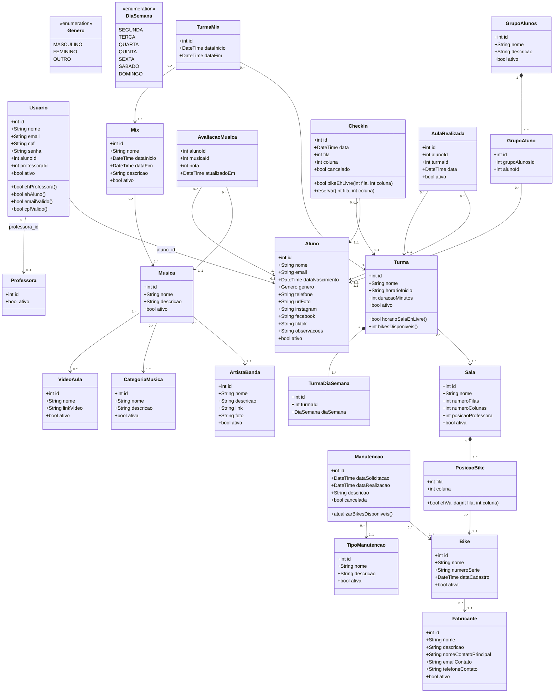

```mermaid
%%{init: {'themeVariables': { 'fontSize': '18px' }}}%%
classDiagram
    direction TB

    %% Enumeracoes
    class Genero {
        <<enumeration>>
        MASCULINO
        FEMININO
        OUTRO
    }

    class DiaSemana {
        <<enumeration>>
        SEGUNDA
        TERCA
        QUARTA
        QUINTA
        SEXTA
        SABADO
        DOMINGO
    }

    %% Autenticacao
    class Usuario {
        +int id
        +String nome
        +String email
        +String cpf
        +String senha
        +int alunoId
        +int professoraId
        +bool ativo
        +bool ehProfessora()
        +bool ehAluno()
        +bool emailValido()
        +bool cpfValido()
    }

    class Professora {
        +int id
        +bool ativo
    }

    %% Folhas - Bikes e Manutencao
    class Fabricante {
        +int id
        +String nome
        +String descricao
        +String nomeContatoPrincipal
        +String emailContato
        +String telefoneContato
        +bool ativo
    }

    class Bike {
        +int id
        +String nome
        +String numeroSerie
        +DateTime dataCadastro
        +bool ativa
    }

    class Manutencao {
        +int id
        +DateTime dataSolicitacao
        +DateTime dataRealizacao
        +String descricao
        +bool cancelada
        +atualizarBikesDisponiveis()
    }

    class TipoManutencao {
        +int id
        +String nome
        +String descricao
        +bool ativa
    }

    %% Folhas - Musica
    class ArtistaBanda {
        +int id
        +String nome
        +String descricao
        +String link
        +String foto
        +bool ativo
    }

    class CategoriaMusica {
        +int id
        +String nome
        +String descricao
        +bool ativa
    }

    class VideoAula {
        +int id
        +String nome
        +String linkVideo
        +bool ativo
    }

    class Mix {
        +int id
        +String nome
        +DateTime dataInicio
        +DateTime dataFim
        +String descricao
        +bool ativo
    }

    class Musica {
        +int id
        +String nome
        +String descricao
        +bool ativo
    }

    class AvaliacaoMusica {
        +int alunoId
        +int musicaId
        +int nota
        +DateTime atualizadoEm
    }

    %% Salas e Turmas
    class Sala {
        +int id
        +String nome
        +int numeroFilas
        +int numeroColunas
        +int posicaoProfessora
        +bool ativa
    }

    class PosicaoBike {
        +int fila
        +int coluna
        +bool ehValida(int fila, int coluna)
    }

    class Turma {
        +int id
        +String nome
        +String horarioInicio
        +int duracaoMinutos
        +bool ativo
        +bool horarioSalaEhLivre()
        +int bikesDisponiveis()
    }

    class TurmaDiaSemana {
        +int id
        +int turmaId
        +DiaSemana diaSemana
    }

    class TurmaMix {
        +int id
        +DateTime dataInicio
        +DateTime dataFim
    }

    %% Alunos e usuarios
    class Aluno {
        +int id
        +String nome
        +String email
        +DateTime dataNascimento
        +Genero genero
        +String telefone
        +String urlFoto
        +String instagram
        +String facebook
        +String tiktok
        +String observacoes
        +bool ativo
    }

    class GrupoAlunos {
        +int id
        +String nome
        +String descricao
        +bool ativo
    }

    class GrupoAluno {
        +int id
        +int grupoAlunosId
        +int alunoId
    }

    class Checkin {
        +int id
        +DateTime data
        +int fila
        +int coluna
        +bool cancelado
        +bool bikeEhLivre(int fila, int coluna)
        +reservar(int fila, int coluna)
    }

    class AulaRealizada {
        +int id
        +int alunoId
        +int turmaId
        +DateTime data
        +bool ativo
    }

    %% Associacoes - Bikes e Manutencao
    Bike "0..*" --> "1..1" Fabricante
    Manutencao "0..*" --> "1..1" Bike
    Manutencao "0..*" --> "1..1" TipoManutencao

    %% Associacoes - Musica
    Musica "0..*" --> "1..1" ArtistaBanda
    Musica "0..*" --> "1..*" CategoriaMusica
    Musica "1..*" --> "0..*" VideoAula
    Mix "0..*" --> "1..*" Musica
    AvaliacaoMusica "0..*" --> "1..1" Musica

    %% Associacoes - Alunos e usuarios
    Usuario "1" --> "0..1" Aluno : aluno_id
    Usuario "1" --> "0..1" Professora : professora_id
    GrupoAlunos "1" *-- "1..*" GrupoAluno
    GrupoAluno "0..*" --> "1..1" Aluno
    Checkin "0..*" --> "1..1" Aluno
    AulaRealizada "0..*" --> "1..1" Aluno
    AvaliacaoMusica "0..*" --> "1..1" Aluno

    %% Associacoes - Salas e Turmas
    Sala "1" *-- "1..*" PosicaoBike
    PosicaoBike "0..*" --> "1..1" Bike
    Turma "0..*" --> "1..1" Sala
    Turma "1" *-- "1..*" TurmaDiaSemana
    Checkin "0..*" --> "1..1" Turma
    AulaRealizada "0..*" --> "1..1" Turma

    %% Associacoes - Cruzamento de clusters
    TurmaMix "0..*" --> "1..1" Turma
    TurmaMix "0..*" --> "1..1" Mix
```
