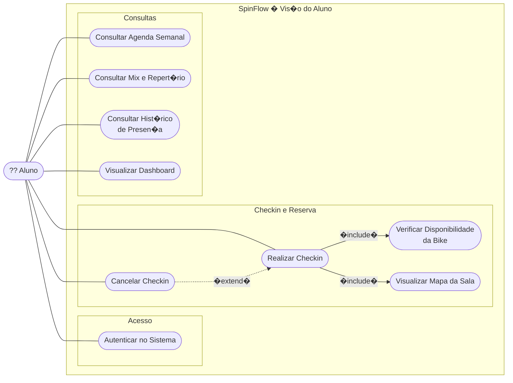
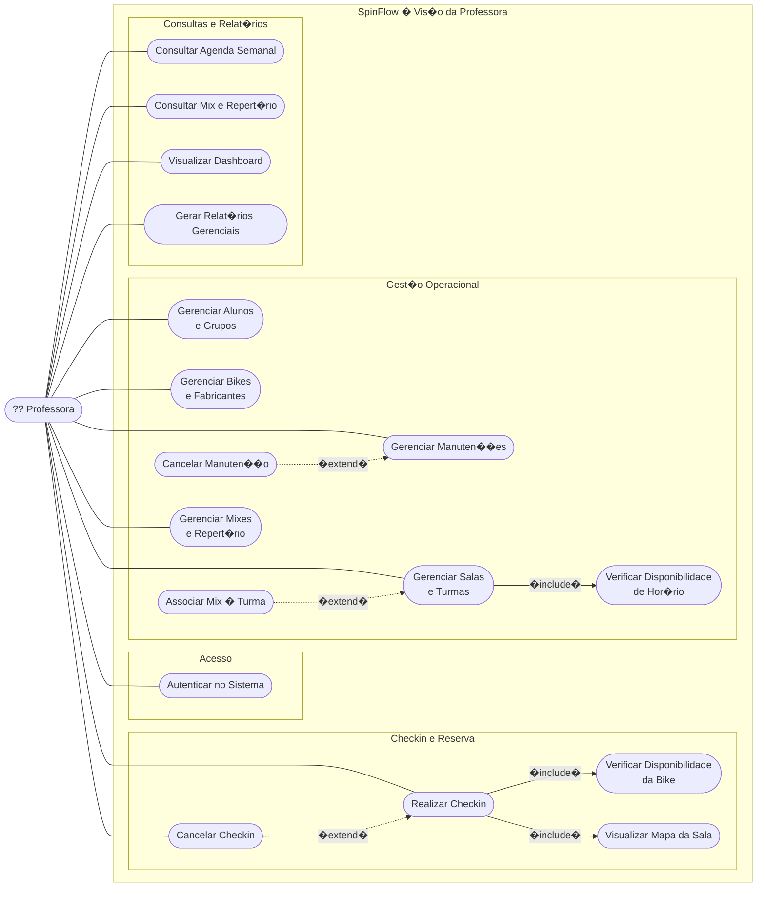

## Diagrama de Caso de Uso � Aluno

---

## Diagrama de Caso de Uso � Professora

---

## Casos de Uso

| ID | Caso de Uso | Professora | Aluno |
|---|---|:---:|:---:|
| UC01 | Autenticar no Sistema | ? | ? |
| UC02 | Realizar Checkin | ? | ? |
| UC03 | Verificar Disponibilidade da Bike *(�include� de UC02)* | � | � |
| UC04 | Visualizar Mapa da Sala *(�include� de UC02)* | � | � |
| UC05 | Cancelar Checkin *(�extend� ? UC02)* | ? qualquer | ? pr�prio |
| UC06 | Gerenciar Alunos e Grupos | ? | � |
| UC07 | Gerenciar Bikes e Fabricantes | ? | � |
| UC08 | Gerenciar Manuten��es | ? | � |
| UC09 | Cancelar Manuten��o *(�extend� ? UC08)* | ? | � |
| UC10 | Gerenciar Salas e Turmas | ? | � |
| UC11 | Verificar Disponibilidade de Hor�rio *(�include� de UC10)* | � | � |
| UC12 | Associar Mix � Turma *(�extend� ? UC10)* | ? | � |
| UC13 | Gerenciar Mixes e Repert�rio | ? | � |
| UC14 | Consultar Agenda Semanal | ? | ? |
| UC15 | Consultar Mix e Repert�rio | ? | ? |
| UC16 | Consultar Hist�rico de Presen�a | � | ? |
| UC17 | Visualizar Dashboard | ? | ? |
| UC18 | Gerar Relat�rios Gerenciais | ? | � |

---

## Legenda

| Nota��o | Tipo | Sem�ntica |
|---|---|---|
| `------?` `�include�` | Include | UC base **sempre** invoca o UC inclu�do � fluxo obrigat�rio. |
| `- - - -?` `�extend�` | Extend | UC de extens�o **opcionalmente** adiciona comportamento ao UC base � condicional. |
| `-------` | Associa��o | Ator participa do caso de uso. |
