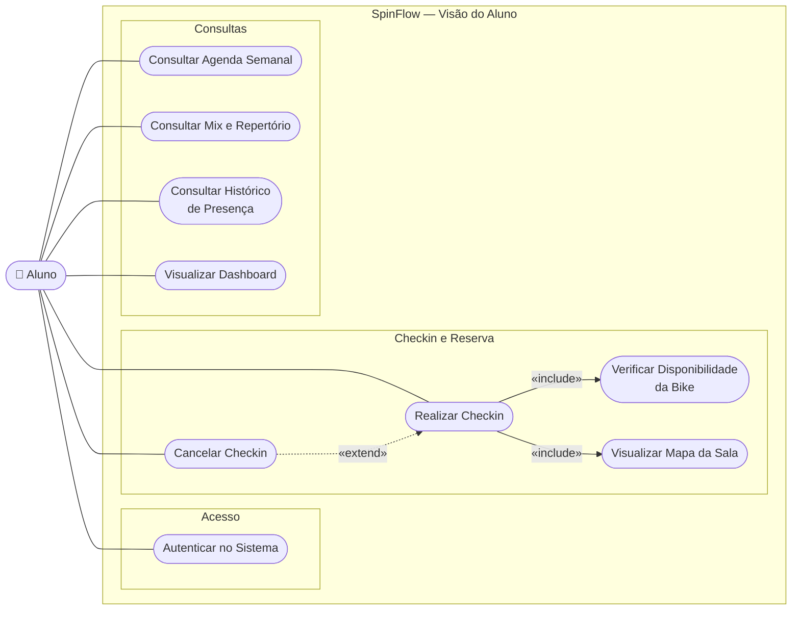

```mermaid
flowchart LR
    Aluno(["👤 Aluno"])

    subgraph SpinFlow["SpinFlow — Visão do Aluno"]
        direction TB

        subgraph SG1["Acesso"]
            UC01(["Autenticar no Sistema"])
        end

        subgraph SG2["Checkin e Reserva"]
            UC02(["Realizar Checkin"])
            UC03(["Verificar Disponibilidade\nda Bike"])
            UC04(["Visualizar Mapa da Sala"])
            UC05(["Cancelar Checkin"])
        end

        subgraph SG3["Consultas"]
            UC14(["Consultar Agenda Semanal"])
            UC15(["Consultar Mix e Repertório"])
            UC16(["Consultar Histórico\nde Presença"])
            UC17(["Visualizar Dashboard"])
        end
    end

    %% ── Associações ─────────────────────────────────────────────
    Aluno --- UC01
    Aluno --- UC02
    Aluno --- UC05
    Aluno --- UC14
    Aluno --- UC15
    Aluno --- UC16
    Aluno --- UC17

    %% ── «include» ───────────────────────────────────────────────
    UC02 -->|"«include»"| UC03
    UC02 -->|"«include»"| UC04

    %% ── «extend» ────────────────────────────────────────────────
    UC05 -.->|"«extend»"| UC02
```
